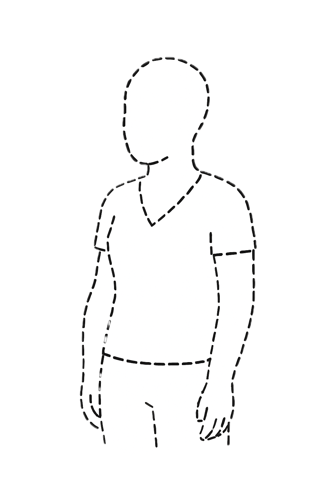

<section class="hero container fade-in">
  

    

      iOS + iPadOS app
      AI coaching
      Built in Tahiti
    

    <h1>Train smarter with coaching that actually tells you what to improve.</h1>
    
Horo Coach analyzes workouts recorded from Apple Watch and Apple Health, then gives clear feedback and concrete next steps in your preferred coaching tone.

    

      <a class="btn btn-primary" href="#" aria-label="Download on the App Store">Download on the App Store</a>
      <a class="btn btn-secondary" href="plans.html">Compare Free vs Premium</a>
    

  

  

    

      

        
Coach Focus

        

          
          
          
          
          
        

      

    

    

      

        
Today: Running Analysis

        

          
          
          
          
          
        

      

    

  

</section>

<section class="container fade-in">
  

    <h2 class="section-title">Raw fitness data is useful. Direction is better.</h2>
    
Pace, cadence, power and heart rate are valuable. But after a workout, most people still wonder: what should I change next?

  

</section>

<section class="container fade-in">
  <h2 class="section-title">Horo turns analysis into action.</h2>
  
Every workout analysis identifies the relevant metrics for that activity type, explains what matters, and provides practical improvements for your next session.

  

    <article class="card">
      <h3>Analyze</h3>
      
Activity-specific metrics are selected automatically.

    </article>
    <article class="card">
      <h3>Explain</h3>
      
Feedback is clear and useful, never overloaded.

    </article>
    <article class="card">
      <h3>Improve</h3>
      
You get immediate next steps to apply.

    </article>
  

</section>

<section class="container fade-in" id="how-it-works">
  <h2 class="section-title">How it works</h2>
  

    <article class="card step">
      <h3>Import workouts</h3>
      
Sync data from Apple Health workouts recorded by Apple Watch and compatible apps.

    </article>
    <article class="card step">
      <h3>Get AI feedback</h3>
      
Horo identifies strengths, inefficiencies and progression signals.

    </article>
    <article class="card step">
      <h3>Apply recommendations</h3>
      
Follow focused guidance in your next session.

    </article>
  

</section>

<section class="container fade-in">
  <h2 class="section-title">All Apple Watch activity types are supported</h2>
  
Running, cycling, swimming, HIIT, strength, yoga, hiking, rowing and every other Apple Watch workout type are supported. Horo adapts analysis depth to each activity and highlights the metrics that matter most for that effort.

</section>

<section class="container fade-in">
  <h2 class="section-title">Meet the coaches</h2>
  
Choose the coaching personality that fits you best. The fourth slot is a seasonal mystery coach.

  

    

      <article class="coach-card">
        Core Coach
        
        <h3>Harmonie</h3>
        
Holistic coach focused on balance, energy and sustainable progress.

      </article>
      <article class="coach-card">
        Core Coach
        
        <h3>Carl</h3>
        
Data-driven analyst who translates metrics into precise action.

      </article>
      <article class="coach-card">
        Core Coach
        
        <h3>Sarge Kruger</h3>
        
High-discipline coach with direct feedback and a no-excuses tone.

      </article>
      <article class="coach-card">
        Seasonal Coach
        
        <h3>Mystery Coach</h3>
        
A limited-time seasonal personality with a unique style and tone.

      </article>
    

    

      <button class="carousel-btn" data-carousel-prev aria-label="Previous coach">←</button>
      <button class="carousel-btn" data-carousel-next aria-label="Next coach">→</button>
    

  

</section>

<section class="container fade-in">
  <h2 class="section-title">Why athletes choose Horo</h2>
  

    <article class="card">
      <h3>Actionable feedback</h3>
      
Specific coaching points, not generic motivation.

    </article>
    <article class="card">
      <h3>Activity-aware AI analysis</h3>
      
Metrics are interpreted according to workout type.

    </article>
    <article class="card">
      <h3>Multiple coach personalities</h3>
      
Three core coaches plus a rotating seasonal mystery coach.

    </article>
    <article class="card">
      <h3>Built for iOS and iPadOS</h3>
      
Apple Watch records the workout, Horo handles smart analysis on iPhone and iPad.

    </article>
  

</section>

<section class="container fade-in">
  <h2 class="section-title">Screenshots</h2>
  
Swipe through key moments of the in-app coaching experience.

  

    

      <article class="shot">
        <h3>Workout summary</h3>
        
See your effort profile at a glance before reading the full analysis.

      </article>
      <article class="shot">
        <h3>Coach feedback</h3>
        
Clear feedback with strengths, blind spots and immediate priorities.

      </article>
      <article class="shot">
        <h3>Improvement plan</h3>
        
Targeted recommendations for your next session.

      </article>
      <article class="shot">
        <h3>Coach personality switch</h3>
        
Pick the coaching style that keeps you consistent.

      </article>
    

    

      <button class="carousel-btn" data-carousel-prev aria-label="Previous screenshot">←</button>
      <button class="carousel-btn" data-carousel-next aria-label="Next screenshot">→</button>
    

  

</section>

<section class="container fade-in">
  <h2 class="section-title">Who it is for</h2>
  

    <article class="card">
      <h3>Active beginners</h3>
      
Understand your workouts without needing sports science expertise.

    </article>
    <article class="card">
      <h3>Consistency-focused athletes</h3>
      
Improve one session at a time with clear direction.

    </article>
    <article class="card">
      <h3>Data-driven Apple users</h3>
      
Turn Health data into decisions, not just dashboards.

    </article>
  

</section>

<section class="container fade-in">
  

    <h2>Your next breakthrough starts after your next workout.</h2>
    
Start free, then unlock Premium for unlimited analyses and advanced activity-specific insights.

    

      <a class="btn btn-secondary" href="#" aria-label="Download Horo Coach on the App Store">Get Horo Coach on the App Store</a>
      <a class="btn btn-secondary" href="plans.html">Compare plans</a>
    

  

</section>
